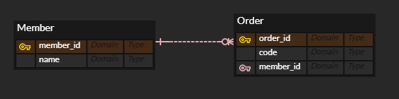
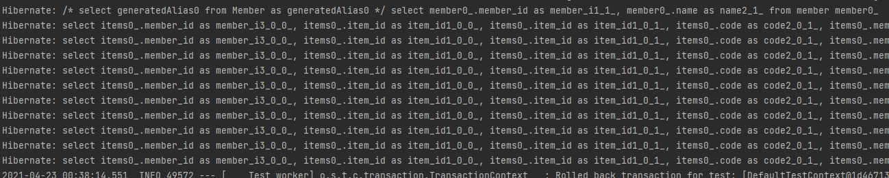
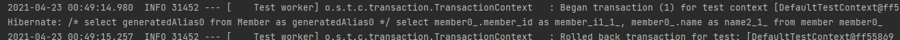
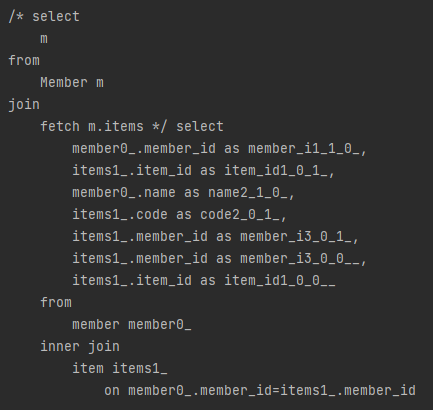
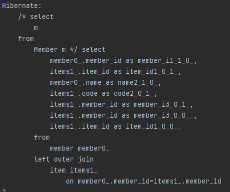

# N+1문제

JPA를 제대로 알고 써야겠다는 생각에 평소에 지나쳤던 N+1문제에 대해 파고들어보자고 생각했다.

어떤문제이고 어떻게 해결해야 하는지 알아보자

## N+1 문제란?

1:N 관계를 가지는 엔티티를 조회할 때 발생하는 문제로 

  

### Member
```java
@Id
@GeneratedValue(strategy = GenerationType.IDENTITY)
@Column(name = "member_id")
private Long id;

private String name;

@OneToMany(mappedBy = "member", fetch = FetchType.EAGER)
//@OneToMany(mappedBy = "member", fetch = FetchType.LAZY)
private Set<Item> items = new HashSet<>();
```
### Item
```java
@Id
@GeneratedValue(strategy = GenerationType.IDENTITY)
@Column(name = "item_id")
private Long id;

private String code;

@ManyToOne(fetch = FetchType.LAZY)
@JoinColumn(name = "member_id")
private Member member;
```
이렇게 member와 item 사이의 1:n 관계를 정의했을때  
fetch 전략을 eager로 가져가면 
```java
@Test
void N_쿼리테스트(){
    List<Member> members = memberRepository.findAll();
}
```

findall() 테스트에서 가차없이 10번의 멤버수에 비례하는 쿼리가 날라간다.  

findall() 한번만 수행했을 뿐인데 왜 쿼리가 10번 날아갔을까?

JPQL이 member의 하위 엔티티 order를 한땀 한딴 쿼리해오기 때문에 그렇다.

그렇다면 lazy면 다를까?
### Member (EAGER -> LAZY)
```java
//@OneToMany(mappedBy = "member", fetch = FetchType.EAGER)
@OneToMany(mappedBy = "member", fetch = FetchType.LAZY)
private Set<Item> items = new HashSet<>();
```


당신의 쿼리 한방 쿼리로 대체되었다.

하지만 여전히 문제가 있는데

```java
@Test
void N1_쿼리테스트(){
    List<Member> members = memberRepository.findAll();
    for(Member member: members){
        System.out.println(member.toString());
        System.out.println(member.getItems().size());
    }
}
```
이렇게 하위 엔티티에 접근하는 순간 동일한 문제가 발생한다는 것이다.

LAZY로 설정하면 지연 로딩이 수행되어 목표로하는 member가 쿼리되고 하위 엔티티인 itemdms

persistentBag으로 감싸진 프록시 객체로 가지고 있게 된다.

결국은 필요할때 DB에서 쿼리해야 하고 하나 하나를 member를 키로 조인하여 select문이 발생한다.

# 해결법

널리 쓰이는 방법으로는 fetch join을 사용하고 그외에 batch size 조정, entity graph등의 방법이 있다.

## fetch join

join은 들어본적이 있는데 fetch join은 뭘까?

hibernate 문서를 뒤져보면 나오는데 한마디로

collection의 연관 관계에서 잘 사용할 수 있는 join방식으로 한번의 쿼리를 통해 연관된 객체를 통째로 가져온다.

즉 n+1문제를 해결하는데 딱 좋은 방법이다.
### MemberRepository
```java
@Repository
public interface MemberRepository extends JpaRepository<Member, Long> {
    @Query("select m from Member m join fetch m.items")
    Set<Member> findAllByJoinFetch();
}
```

```java
@Test
void FetchJoin_쿼리테스트(){
    Set<Member> members = memberRepository.findAllByJoinFetch();
    for(var member: members){
        System.out.println(member.getItems().size());
    }
}
```
이렇게 fetch 하나 붙인걸로 한방쿼리, 편안~ 해질 수 있다.

## EntityGraph

엔티티 그래프는 또 뭘까?

문서를 찾아보면 런타임에 연관관계를 fetch할지 설정해주는 역할을 하는 듯 하다

[문서보기](https://www.baeldung.com/jpa-entity-graph)  
### MemberRepository
```java
@Repository
public interface MemberRepository extends JpaRepository<Member, Long>{
    @Query("select m from Member m join fetch m.items")
    Set<Member> findAllByJoinFetch();

    @EntityGraph(attributePaths = "items")
    @Query("select m from Member m")
    List<Member> findAllByEntityGraph();
}
```
```java
@Test
void EntityGraph_쿼리테스트(){
    List<Member> members = memberRepository.findAllByEntityGraph();
    for(var member: members){
        System.out.println(member.getItems().size());
    }
}
```
이런식으로 적용해 볼 수 있다.

한가지 알아두어야할 점은 

  
fetch join은 inner join을 사용하고

  
entity graph는 left outer join이 발생한다.

또한 공통적으로 카티전 곱 만큼의 객체가 생성되므로 쿼리에 distinct를 적용하거나  

Set을 사용해야 한다.

## 그외

batch size의 경우 eager을 사용하면서 batch해오는 사이즈를 제한하는 방법인데

기본적으로 LAZY를 지향하기 때문에 추천하지 않는다.

또한 fetch join의 단점으로 크게 드는 것이 1:N 관계를 다중으로 가지면 예외가 발생한다는 점

paging 기능을 사용할 수 없다는 점이 있다 이부분은 다음에 좀 더 알아보도록 하자

---
### 출처
[https://jojoldu.tistory.com/165](https://jojoldu.tistory.com/165)  
[https://www.popit.kr/jpa-n1-%EB%B0%9C%EC%83%9D%EC%9B%90%EC%9D%B8%EA%B3%BC-%ED%95%B4%EA%B2%B0-%EB%B0%A9%EB%B2%95/](https://www.popit.kr/jpa-n1-%EB%B0%9C%EC%83%9D%EC%9B%90%EC%9D%B8%EA%B3%BC-%ED%95%B4%EA%B2%B0-%EB%B0%A9%EB%B2%95/)  
[https://wwlee94.github.io/category/blog/spring-jpa-n+1-query/](https://wwlee94.github.io/category/blog/spring-jpa-n+1-query/)
